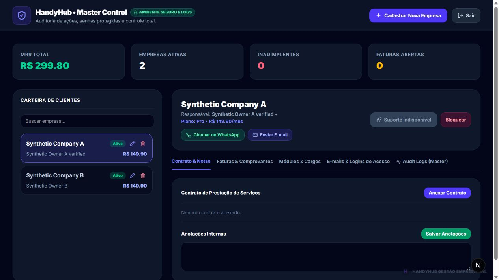
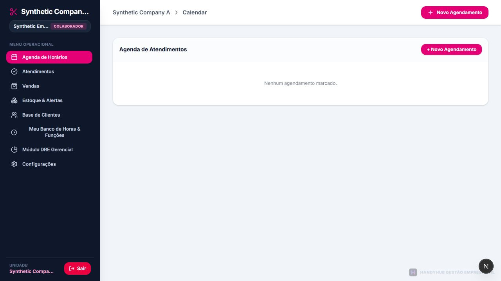

# HandyHub — Camada 1B: cutover de segurança no staging

Data: 08/10/2026. Projeto exclusivo: `handyhub-staging`, ref
`gbblkkgowccjycxtexvx`, organização Thaleco7. Production não foi autorizada.

## 1. STATUS CUTOVER STAGING — CONCLUÍDO

Aplicação transacional de `supabase/activation/camada-1-cutover.sql`, com
confirmação operacional explícita e validação de platform admin e owner Auth
ativo para cada tenant. Histórico remoto:
`20261008171522_staging_security_cutover`. Não houve nova execução do cutover
ao retomar depois da interrupção de energia; apenas leitura do estado final.

O staging permaneceu ativo e isolado. Ao final há 11 identidades Auth sintéticas
confirmadas, 9 memberships, 2 tenants e 1 platform admin. Os testes adicionais
de convite criaram identidades sintéticas próprias, sem enviar e-mails.

`companies` não contém linha sem `tenant_id` no staging: contagem zero antes e
depois. Não houve motivo para associar, excluir ou recriar uma linha. Nenhuma
linha de Production foi alterada.

## 2. RLS por tabela

| Tabela | RLS final | FORCE |
|---|---|---|
| tenants | Ligado | Desligado |
| tenant_data | Ligado | Desligado |
| companies | Ligado | Desligado |
| tenant_memberships | Mantido ligado | Desligado |
| platform_admins | Mantido ligado | Desligado |

FORCE foi avaliado, não habilitado por padrão. `anon` e `authenticated` não são
owners das tabelas nem possuem BYPASSRLS: RLS limita suas operações normalmente.
O owner real `postgres` possui BYPASSRLS; FORCE não restringiria essa role nem
`service_role`. Os helpers privados de membership/admin preservam sua leitura
interna autorizada. A segurança das chaves privilegiadas continua essencial.
Referência: [PostgreSQL 17 — Row Security](https://www.postgresql.org/docs/17/ddl-rowsecurity.html).

As 13 policies existentes foram revisadas e mantidas. Todas se destinam a
`authenticated`. A função privada `has_tenant_role` compara `auth.uid()` com
membership ativa, `tenant_id` e role aceita; `is_platform_admin` consulta a
associação de plataforma do mesmo UID. Não usam `user_metadata` como autoridade.
Os helpers SECURITY DEFINER têm `search_path` vazio e execução pública/anon
revogada. O trigger de identidade executa com os privilégios do chamador.

| Tabela | SELECT | INSERT | UPDATE | DELETE |
|---|---|---|---|---|
| tenants | owner/manager/employee do tenant; platform admin | Platform admin | Owner do tenant; platform admin, com limite de colunas | Platform admin |
| tenant_data | owner/manager/employee do tenant; platform admin | Owner/manager do tenant; platform admin | Owner/manager do tenant; platform admin | Owner/manager do tenant; platform admin |
| companies | owner/manager/employee do tenant; platform admin | Owner/manager do tenant; platform admin | Owner/manager do tenant; platform admin | Owner/manager do tenant; platform admin |
| tenant_memberships | Própria membership; owner da empresa; platform admin | Servidor privilegiado | Servidor privilegiado | Servidor privilegiado |
| platform_admins | Servidor privilegiado | Servidor privilegiado | Servidor privilegiado | Servidor privilegiado |

INSERT usa WITH CHECK; UPDATE usa USING e WITH CHECK. `companies` também exige
`tenant_id IS NOT NULL`. As associações e os administradores não podem ser
criados/promovidos diretamente pelo navegador. A tabela `platform_admins` não
tem policy pública: acesso pela API comum é negado deliberadamente.

## 3. Grants finais

`PUBLIC`, `anon` e os grants amplos antigos de `authenticated` foram removidos
das três tabelas empresariais. Não restaram grants de TRUNCATE, REFERENCES ou
TRIGGER para anon/authenticated nessas tabelas.

`authenticated` recebeu somente:

- `tenants`: SELECT em 15 colunas de identidade/perfil/plano; INSERT em 13
  colunas de cadastro; UPDATE em 7 campos de perfil; DELETE condicionado à
  policy de platform admin. Sem acesso direto a `logins` ou `invoices`, sem
  UPDATE de status, assinatura, slug ou ID.
- `tenant_data`: SELECT/INSERT/DELETE e UPDATE de `tenant_id`, `tenant_slug`,
  `data_key`, `payload`, `updated_at`; RLS limita às memberships/roles previstas.
  O trigger rejeita slug desconhecido/incompatível e a policy impede transferir
  a linha para empresa não autorizada. O upsert utilizado pelo app foi testado.
- `companies`: CRUD condicionado às policies; USAGE da sequência de IDs.
- `tenant_memberships`: SELECT condicionado à policy. Nenhuma escrita.
- `platform_admins`: nenhum grant para o cliente.

Privilégios internos do Supabase e service role não foram revogados. Defaults
de novos objetos pertencentes a `postgres` ficaram fechados para as roles
públicas; defaults da role gerenciada `supabase_admin` só são alteráveis se a
conexão tiver autorização. Não foi feita impersonação dessa role.

`authService.ts` e `dbService.ts` usam SELECT explícito compatível com os grants.
Faturas/status do Master passam pelas APIs autorizadas do servidor, sem
conceder acesso amplo a `authenticated`.

## 4. Teste ANON — PASSOU

Chamadas PostgREST reais com a chave anon própria do staging: SELECT negado nas
cinco tabelas; INSERT/UPDATE/DELETE negados em tenants, tenant_data e companies.
Não foi usado JWT falso nem teste de dados reais. Master sem sessão: HTTP 401.

## 5. Empresa A → A — PERMITIDO

Owner A lê somente o tenant, payload e company de A. Atualiza perfil permitido
e payload de A; manager A atualiza payload de A. Upsert do app passou após
cutover. Owner B também lê/atualiza B conforme previsto.

## 6. Empresa A → B — NEGADO

Consultas reais de owner/manager/employee A só retornam A; owner B só retorna B.
Filtros explícitos pelo ID/slug estrangeiro não retornam linhas. Sem membership,
o usuário autenticado recebe zero empresas. Usuário com duas memberships vê
exatamente A e B: esse acesso é autorizado por ambas as associações.

## 7. UPDATE A → B — NEGADO

UPDATE estrangeiro retorna zero linhas afetadas, sem alterar B. A verificação
privilegiada do payload de B preservou seu marcador. DELETE estrangeiro também
retorna zero linhas. As provas foram simétricas A→B e B→A nas três tabelas
empresariais. INSERT estrangeiro foi rejeitado.

Uma resposta HTTP bem-sucedida com zero linhas em UPDATE/DELETE é o bloqueio
esperado por USING; os testes verificaram a quantidade e a preservação do alvo.

## 8. Employee / manager / owner — PASSARAM

Employee A lê sua empresa, dados e própria membership. INSERT/UPDATE/DELETE do
JSON e UPDATE de companies são negados. Manager A escreve dados operacionais
de A, mas UPDATE do perfil exclusivo de owner e criação de tenant são negados.
Owner A escreve os campos de perfil permitidos e os dados de A; não altera
status, faturas, credenciais antigas ou memberships/admins.

O modelo `all_data` é um JSON único: employee tem leitura e não recebe escrita
genérica nesse payload. Isso limita também funcionalidades operacionais de
escrita; a interface ainda pode apresentar botões legados. Este relatório
comprova isolamento e privilégios de banco, não aprovação funcional de todos
os módulos nem controle granular de leitura dentro desse JSON.

## 9. Master — PASSOU

Interface: owner e employee recebem “Acesso restrito”; platform admin entra no
Master e vê as duas empresas sintéticas. Logout remove o acesso e volta ao login.

Dados/alterações: endpoints Master recusam usuário comum com HTTP 403 para
GET/POST/PATCH/DELETE. Platform admin recebe GET 200, POST 201, PATCH 200 e
DELETE 200 em cadastro descartável. Fatura/status persistidos foram verificados
no staging e revertidos pelo mesmo caminho autorizado. Não foi excluído tenant
empresarial com dados vinculados.

Privilégios: cada chamada valida Supabase Auth e consulta `platform_admins` no
servidor antes de usar a service role. Mutação aceita apenas campos validados;
`logins` e origem estrangeira são rejeitados. Parâmetros de suporte, role ou
tenant na URL não ampliam acesso. Não há senha Master literal ativa, flag local
de autorização ou bypass de suporte. Suporte aparece indisponível.

`service_role` está em módulo `server-only`; zero correspondências da chave
real do staging em 37 arquivos JS do bundle do navegador e 87 arquivos
versionáveis no momento da varredura. Nenhuma credencial foi incluída no relatório.
Anotações/contratos e outras ações sem caminho seguro implementado permanecem
indisponíveis; não foram declaradas operacionais.

## 10. Equipe — PASSOU

Login usa Supabase Auth; membership e role são carregadas pelo UID confirmado.
Funcionário A entra como Colaborador de A. Mesmo visitando `/equipe` com ID e
slug de B na URL, a interface mantém A; chamadas diretas não leem/escrevem B.
Não há autenticação paralela por `staffDatabase` ou `passwordHash` nesse fluxo.
API de login legada `/api/equipe` está encerrada: POST 410 / GET 405.

## 11. Manipulação direta de tenant — NEGADA

Foram testados ID estrangeiro em filtro, slug estrangeiro, INSERT com tenant B,
UPDATE de payload B, troca de slug, troca conjunta de slug/ID, transferência de
company para B, URL da Equipe com B, endpoint Master apontando para B e campos
indevidos de convite. Bloqueio ocorreu no banco/servidor, independentemente de
botões ou seleção na interface. Campos de role/redirect/userId fornecidos pelo
cliente não criam associação privilegiada.

## 12. Convite — MECANISMO PASSOU; E-MAIL PENDENTE PARA PRODUÇÃO

Tokens oficiais gerados pelo Auth do staging, sem simular envio: GET do link
não consome o token; POST confirma OTP, cria sessão/cookies SSR e encaminha à
definição de senha; UID corresponde à membership registrada. A conta define
sua senha Auth, sai e faz login normal preservando tenant/role. Token inválido
ou consumido é rejeitado; manipulação de tenant, redirect e origem é negada.

O callback PKCE continua separado do callback `token_hash`; não depende de
verificador PKCE do navegador do remetente. Conta já confirmada não é promovida
ou reanexada silenciosamente por convite.

O endpoint normal de envio continua retornando 503 para owner/manager autorizado
enquanto o template/transporte necessário não estiver configurado. Não envia
link inseguro nem devolve token ao cliente. Não foi configurado SMTP nesta tarefa.
Entrega real do e-mail não foi provada e continua obrigatória para Production.

## 13. Recuperação — MECANISMO PASSOU; ENTREGA PENDENTE

Token oficial de recovery aceito pelo callback cria sessão SSR da conta exata.
A senha é alterada pelo próprio Auth; senha anterior falha e nova senha permite
login. Não houve bypass de recuperação ou escrita SQL em auth.users. Entrega
real pelo e-mail depende da infraestrutura pendente e não foi declarada validada.

## 14. Testes automatizados

| Verificação | Resultado |
|---|---|
| npm test | 26 passaram, zero falhas |
| TypeScript (`tsc --noEmit`) | Passou |
| Lint direcionado ao código de segurança alterado e testes | Zero erros/avisos |
| git diff --check | Passou; apenas avisos LF/CRLF do Git |
| Suíte real antes do cutover | 12 grupos passaram |
| Suíte real após cutover | 17 grupos passaram |
| Convite/recovery reais antes e depois | 9 grupos passaram em cada execução |
| Navegador real | Owner A, employee A, Master negado/permitido e logout passaram |
| Teste Postgres local (PGlite) | Isolamento, grants, roles, transferências e flags RLS passaram |

Uma verificação adicional do arquivo legado `/equipe/page.tsx`, sem alteração
nesta execução, encontrou 32 erros e 19 avisos existentes. Não foi declarado
lint global limpo nem foram feitas correções de módulos fora do escopo.

Advisor de performance do staging: sem apontamentos. Advisor de segurança:
INFO por `platform_admins` com RLS sem policy, deliberadamente fechado; WARN por
proteção de senhas vazadas desabilitada. Não foi feito upgrade nem mudança Auth
para remover esse aviso. Referências:
[RLS sem policy](https://supabase.com/docs/guides/database/database-linter?lint=0008_rls_enabled_no_policy) e
[proteção de senhas](https://supabase.com/docs/guides/auth/password-security#password-strength-and-leaked-password-protection).

## 15. Build — PASSOU

Build Webpack otimizado concluído com configuração exclusiva do staging.
TypeScript e geração das páginas passaram. Nenhum deploy foi executado.

## 16. Git

Branch local `codex/camada-1-auth`; base `dc7dcbba1ab2bb8e863a08424b20a08fe1d6278d`.
As correções locais acumuladas de Auth, callback, Master, grants, testes e
evidências foram reunidas em commit local da Camada 1B ao encerrar a tarefa,
com mensagem `feat(security): validate Auth and tenant RLS in staging`.
Nenhum merge na main, push ou deploy.

Preview novo não foi necessário: browser, APIs e PostgREST foram validados
localmente contra staging real fechado. A configuração Preview separada da
preparação anterior foi preservada; uma futura publicação exigirá callbacks,
SITE_URL e configuração completa do transporte correspondentes ao Preview.
Não se declarou um Preview publicado/validado nesta execução.

## 17. handyhub-db — INALTERADO POR ESTA EXECUÇÃO

Ref de Production: `qmfwsnhpmsonndhgqsyi`. Consultas de metadados somente leitura
antes e depois mostraram o mesmo estado: Auth zero usuários, memberships zero,
3 migrations da fundação, RLS desligado nas 3 tabelas legadas e ligado nas 2 de
identidade; FORCE desligado. Nenhuma migração de cutover consta em Production.
Não foram usadas credenciais de Production nos testes.

Isso preserva também a condição anterior do banco Production temporariamente
aberto; fechar staging não fechou Production.

## 18. Production Vercel — INALTERADA

Painel conferido somente em leitura: deployment
`dpl_CH7dqWURTMipa81rY6Qh1hNNeuMU`, Ready, branch `main`, commit
`382155ba8a4df24b2bab46ff40f038607992ead1`, repositório
`thalesalvim/erp-modular`. Domínios `www.handyhub.com.br` e
`erp-modular-iota.vercel.app`. Mesmo deployment observado antes da tarefa.
Nenhuma variável/configuração Production foi alterada, nenhum deploy foi criado.

## 19. CAMADA 1 — SEGURANÇA TÉCNICA NO STAGING: CONCLUÍDA

Comprovada a cadeia Auth → auth.uid() → membership ativa → tenant_id → RLS.
Anon bloqueado; acesso empresarial condicionado às associações; alteração
estrangeira negada; Master autorizado no servidor; Equipe em Auth real; chaves
privilegiadas fora do navegador. Esta conclusão se aplica ao staging e ao escopo
de isolamento/privilégios testado, não aprova automaticamente todos os módulos.

## 20. PRONTO PARA PRODUCTION? NÃO

Production permanece bloqueada. Não foi executado nenhum procedimento nela.

## 21. O que ainda impede Production

1. Configurar e comprovar entrega real de convites, template seguro e callbacks
   corretos; ativar o envio normal somente após essa validação.
2. Comprovar entrega real da recuperação e fluxo completo pela caixa de e-mail.
3. Revisão final humana do código, matriz de permissões e funcionalidades sob
   grants fechados. Inclui decidir o caminho seguro para histórico de faturas
   empresarial, funcionalidades ainda indisponíveis do Master e escrita
   operacional de employee no JSON único; tratar o lint legado, os avisos de
   segurança Auth e o risco de dependências de desenvolvimento já registrado
   nos relatórios anteriores. Nenhuma permissão será ampliada para contornar isso.
4. Aprovar plano específico de migração/cutover de Production: backup/restauração,
   provisionamento e conferência dos owners/memberships/platform admin reais,
   configuração explícita de ambientes e callbacks, implantação coordenada do
   código Auth e banco fechado, critérios de recuperação e validação posterior.

Encerrado para revisão. Não há autorização implícita para começar outra camada
ou alterar Production após este relatório.

Evidências: [metadados/policies finais](camada-1b-cutover-metadata.json),
[chamadas após cutover](camada-1b-after-evidence.json),
[convite/recuperação](camada-1b-invite-mechanism-evidence.json).
